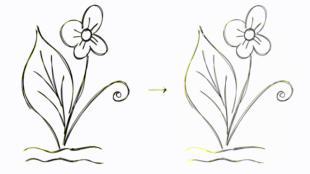

# Ciallo

Ciallo～(∠・ω< )⌒★! Anime computer graphics.

## Introduction

Ciallo aims for improving 2D artists' work efficiency with modern GPU and computational geometry. 

The name "Ciallo" is the combination of the Italian "Ciao" and English "Hello", and comes from the video game *Sabbat of the Witch* developed by *Yuzusoft*.

Ciallo is greatly inspired by [Blender Grease Pencil](https://docs.blender.org/manual/en/latest/grease_pencil/introduction.html). It's a wonderful toolset based on polylines in 3D space inside Blender. Here are some successful artworks drawn with polyline vector lines (in blender): [GPencil open project](https://cloud.blender.org/p/gallery/5b642e25bf419c1042056fc6).

I'm pretty ambitious about the stroke rendering method. Since its simplicity and usefulness, it would be the infrastructure of every 2D game engine and a must-learn technique for everybody learning computer graphics. Everybody should learn how to render a curve just like learn how to render a mesh.

### Vector Bucket Fill

### GPU-rendered Brush 

### ~~Curve binding~~

~~Polylines are hard to edit. So Ciallo allows users to "bind" a polyline upon a bezier curve. It'll act like this:~~

<figure>
    
 

</figure>

## About the Future

I used to think that I could make a program that could produce content even though naïve. But I highly underestimate ~~my laziness~~ the difficulty of programming layers and animation systems. However, as a research project, Ciallo completes its mission nicely.

Now I need a job. Contact me if you are interested in developing a new paint program.

## How to Compile

### Windows

- Pull vcpkg and integrate.
- Pull the codebase and run Ciallo.sln with visual studio.

### External Dependencies

- Rendering
  - OpenGL
- GUI
  - Dear ImGui
  - ImPlot
- Coding Patterns
  - Entt - ECS and event system
- Geometry and algebra
  - CGAL
  - GLM
