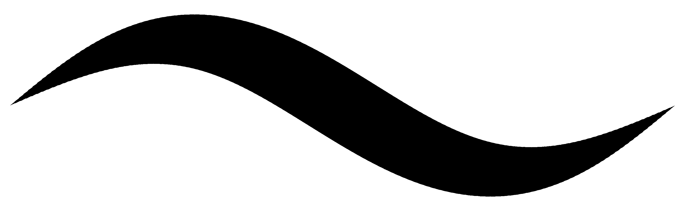
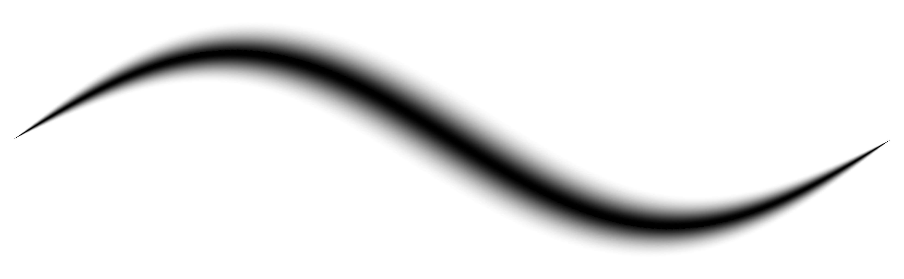
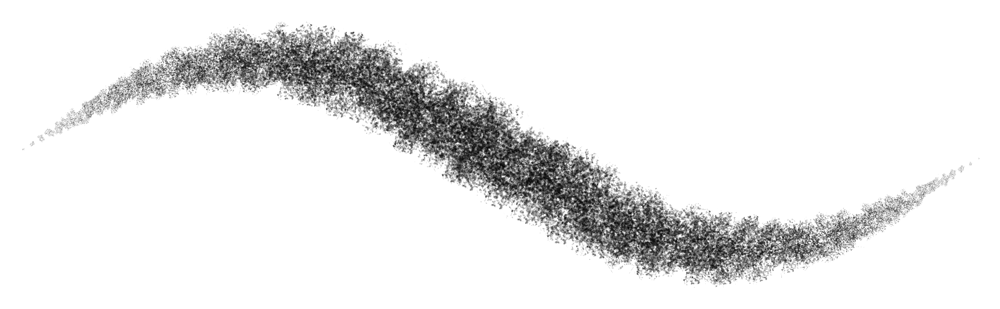
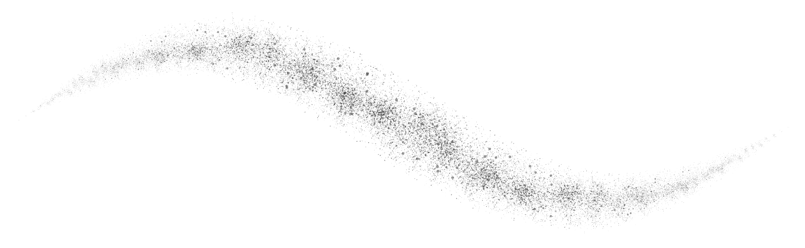
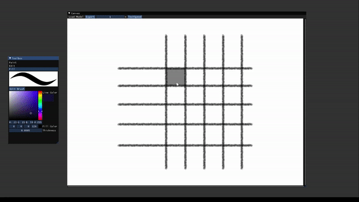
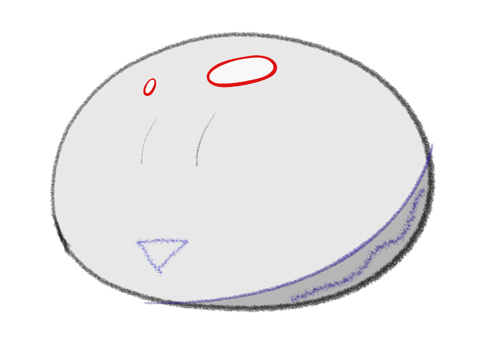
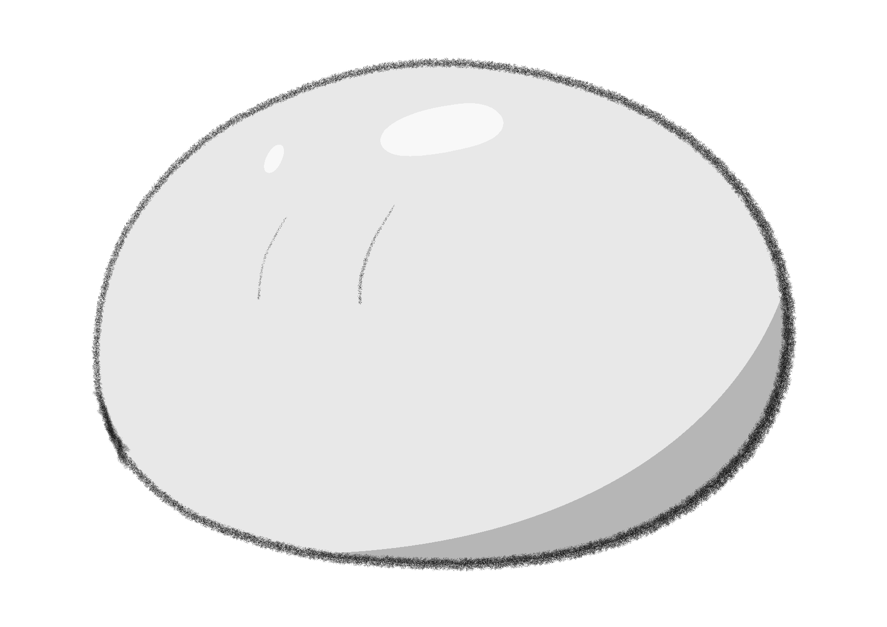
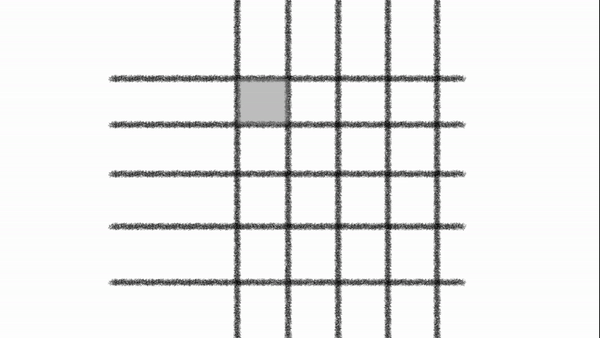

# Ciallo ～(∠・ω< )⌒★!

[Tutorial](https://shenciao.github.io/brush-rendering-tutorial/) → Very detailed technical description with interactive code blocks.

🔴 [SIGGRAPH 2024 Paper](https://cislab.hkust-gz.edu.cn/media/documents/Ciallo.pdf) |
SIGGRAPH 2023 Talk ([Paper](./paper)) ([Presentation](https://youtu.be/KkwW6M16O3c)) |
[Web Demo](https://shenciao.github.io/Ciallo/) |
[Video Demo](https://youtu.be/gqTrD8-nlh0) |
[Blender Implementation (WIP)](https://devtalk.blender.org/t/add-stamp-brush-and-fix-airbrush/30884)

- [Shen Ciao](https://www.linkedin.com/in/shenciao)
- [Li-Yi Wei](https://www.liyiwei.org/)

## 🔴 Introduction
This research project, titled  **_Ciallo: GPU-Accelerated Rendering of Vector Brush Strokes_** is published in SIGGRAPH 2024 as a conference-track technical paper. Its draft version, titled  **_Ciallo: The next-generation vector paint program_** is published in the SIGGRAPH 2023 Talk. The techniques demonstrated in this project have been anticipated by our community for almost two decades.

A [web demo](https://shenciao.github.io/Ciallo) to showcase the stroke rendering technique.

The name "Ciallo" is the combination of the Italian "Ciao" and English "Hello", comes from the video game *Sabbat of the Witch* developed by *Yuzusoft*.

The project is greatly inspired by [Blender Grease Pencil](https://docs.blender.org/manual/en/latest/grease_pencil/introduction.html). To offer a free open-source industrial-level paint program, Shen Ciao will integrate the stroke rendering methods into the grease pencil.

The final version of the [paper](https://cislab.hkust-gz.edu.cn/media/documents/Ciallo.pdf), and its [draft version](./paper) (two-page abstract). The research was first presented at the SIGGRAPH 2023 Conference on Thursday, 10 August 2023 ([video](https://youtu.be/KkwW6M16O3c)), 🔴 and will be presented at the SIGGRAPH 2024 Conference on Monday, 29 July 2024 in Vector Graphics session.

<table>
    <tr>
        <td>
            
Drawn in Ciallo
 
        </td>
        <td>
            
To be drawn in the future

        </td>
    </tr>
    <tr>
        <td>
            
        </td>
        <td>
            
        </td>
    </tr>
</table>

SIGGRAPH 2024 Technical Paper (Conference Track)

    @inproceedings{Ciallo2024,
      author    = {Shen Ciao and Zhongyue Guan and Qianxi Liu and Li-Yi Wei and Zeyu Wang},
      title     = {{Ciallo: GPU-Accelerated Rendering of Vector Brush Strokes}},
      booktitle = {Special Interest Group on Computer Graphics and Interactive Techniques Conference Conference Papers '24 (SIGGRAPH Conference Papers '24)},
      year      = {2024},
      date      = {2024-07-27/2024-08-01},
      venue     = {Denver, CO, USA},
      publisher = {ACM},
      address   = {New York, NY, USA},
      pages     = {1--11},
      doi       = {10.1145/3641519.3657418},
      url       = {https://doi.org/10.1145/3641519.3657418}

SIGGRAPH 2023 Talk

    @inproceedings{Ciallo,
      author = {Ciao, Shen and Wei, Li-Yi},
      title = {Ciallo: The next-Generation Vector Paint Program},
      year = {2023},
      isbn = {9798400701436},
      publisher = {Association for Computing Machinery},
      address = {New York, NY, USA},
      url = {https://doi.org/10.1145/3587421.3595418},
      doi = {10.1145/3587421.3595418},
      booktitle = {ACM SIGGRAPH 2023 Talks},
      articleno = {67},
      numpages = {2},
      keywords = {Digital painting, stylized stroke, arrangement, vector graphics. coloring, graphics processing unit (GPU)},
      location = {Los Angeles, CA, USA},
      series = {SIGGRAPH '23}
    }

## Core Features

### GPU-rendered Brushes

Render stylized strokes on vector lines using Graphic Processing Unit (GPU).

Existing vector paint software restricts the type of brushes available and tends to be laggy - our program enables rendering of most digital brushes with unprecedented efficiency.

Check out the [tutorial](https://shenciao.github.io/brush-rendering-tutorial/) if you are interested in the rendering technique.

Vanilla|Airbrush
:-------------------------:|:-------------------------:
| 

Pencil|Splatter
:-------------------------:|:-------------------------:
| 

### Vector Fill

The positions to fill color are vectorized as the color markers. The markers are similar to regular vector lines. Artists can freely transform and deform them, and the filled areas will be updated in real-time.

Markers and lines|Markers, lines and fills|Lines and fills
:-------------------------:|:-------------------------:|:-------------------------:
 |  | 

### Curve binding

## Trinity!

Each feature individually do not make a big change for artists, until we combine them together!

## About the Future

The project began with a clownish plan. Shen thought he could turn himself into a GPT model which can produce thousands of lines of code per day, several months later, he would get a medium-large paint program that can produce serious 2D content. But it quickly turns out the actual pace is two orders of magnitude slower than the initial plan.

Shen will integrate the techniques into the Blender Grease Pencil to provide an free open-source industrial level paint program for artists.

If this project get concerns by computer graphics community or someone is willing to sponsor, Shen will make a series of tutorial videos about the stroke rendering.

You may have already found several novel features that we never mentioned in the research paper. They will be published in the future.

## How to Compile
### Windows

- Pull vcpkg and integrate.
- Pull the codebase and run `Ciallo/Ciallo.sln` with visual studio.

### External Dependencies

- Rendering
  - OpenGL
- GUI
  - Dear ImGui
  - ImPlot
- Coding Patterns
  - Entt - ECS and event system
- Geometry and algebra
  - CGAL
  - GLM
  - dlib - For curve fitting
