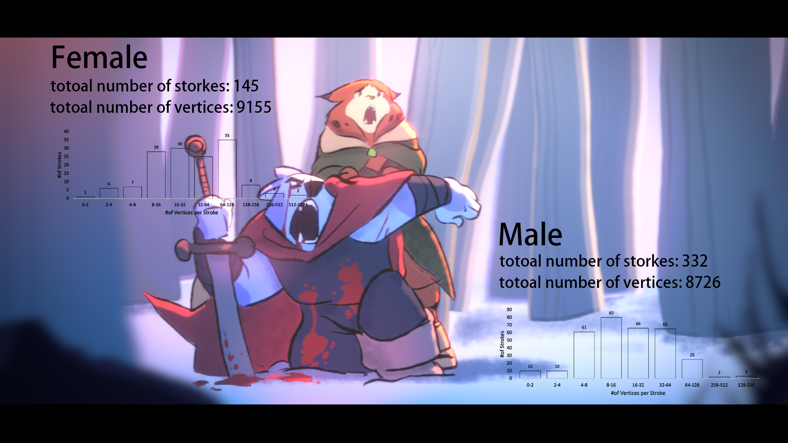
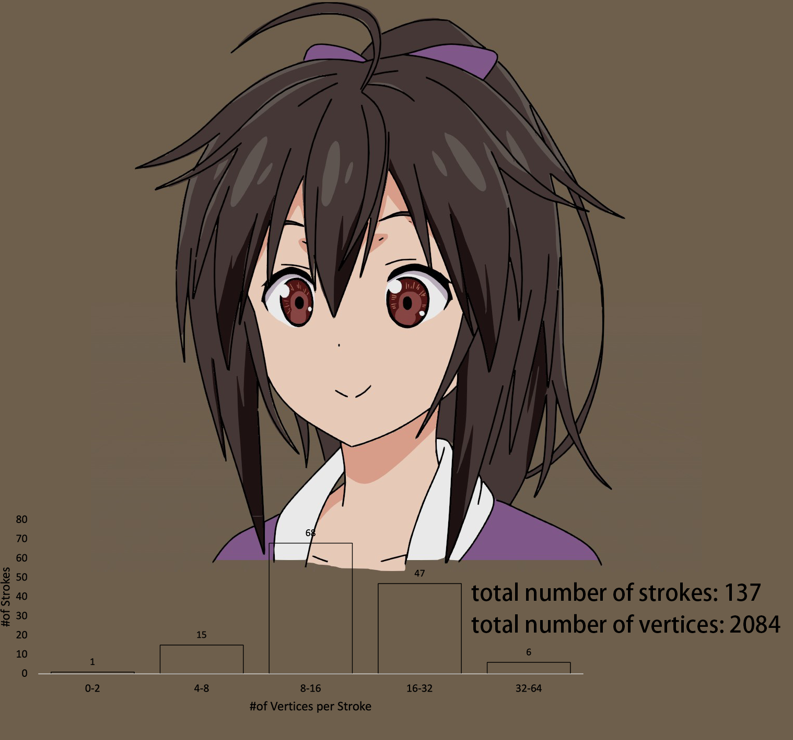

## Statistics on Existing Artworks

The number of strokes and vertices are keys to performance of rendering or arrangement insertion and query. So it's import to know a bit about regular patterns.

You may have noticed that number of vertices from 2D characters are much smaller than [Stanford bunny](http://graphics.stanford.edu/data/3Dscanrep/). Which means we 2D CG developers gain at least 10~100 times of "freedom to code" with GPU compare to 3D, thanks for those hard working 3D CG developers and GPU manufacturers.

Ciallo will persuade our users to use a powerful GPU (usually a discrete one manufactured within recent 5 years). An innovation on visual effects is always more attractive than dull performance improvement. We will definitely concentrate on the former one.

- Statistics underneath do not include polygon vertices generated from outlines.

## VTuber's Avatar

Live2D is the software widely used for making avatars of VTuber. The animation it makes is based on deformation of pixelmaps:

You may notice that highlight on character's hair is "baked" within, and those noise of strokes are deformed unnaturally. As far as Shen Ciao's concern, it's a clumsy mimic of traditional frame by frame drawn animation. And the performance when using the model is definitely bad. It would be much better if it using GPU brush engine and redraw strokes and faces on every frames,  for both visual effects and performance.

Ciallo will try to offer proper assets (and may even brush engines) for Live2D like software. (Please consider sponsor on Ciallo). Software developers in Live2D like software could concentrate on better interpolation, deformation or face rigging algorithms.

