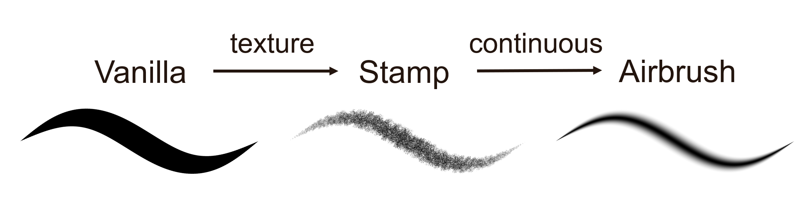
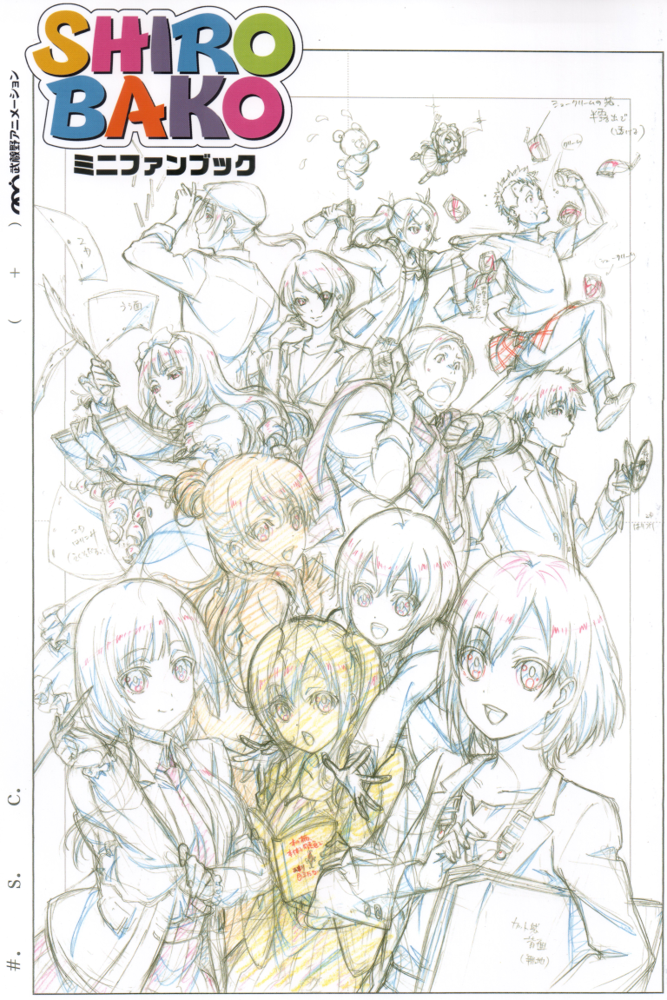
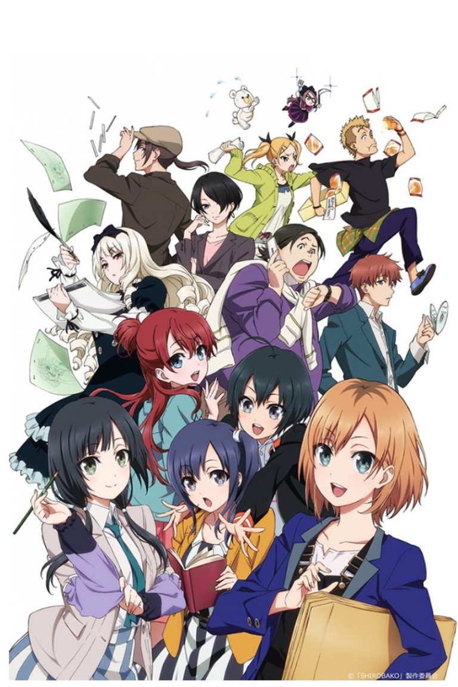

# Ciallo: The Next-Generation Vector Paint Program

## Introduction

Ciallo is a GPU-driven vector paint program. All its brushes are fully rendered by GPU (OpenGL). We can render the vast majority of digital brushes on vector lines, which were only available on pixel images. Soon, digital paint artists will get rid of the issue of lag caused by CPU rendering and create 2D artwork efficiently.

Please check out the [interactive stroke demo](./) to play with our stroke rendering techniques implemented with WebGL. It's open-source.

**_Dango_ by Shen Ciao:**

To introduce our techniques, we publish a paper on SIGRRAPH 2023 Talk, titled *Ciallo: The next-generation vector paint program*. We will present the stroke rendering and vector fill techniques at the [SIGRRAPH 2023 conference](https://s2023.siggraph.org/presentation/?id=gensub_185&sess=sess176).

**Vector Fill:**

The title is kind of exaggerated, I created it hastily and was too lazy to modify it after the review. But I'm pretty sure our stroke rendering technique is invaluable and much more than the paper itself.

Since the bloom of 3D digital art and AI techniques, we computer graphics engineers had been searching for methods to render 2D digital brushes with GPU for nearly two decades, but still, there wasn't a satisfying technique. Our research has made a breakthrough in it. Meanwhile, we create the open-source project Ciallo to share our techniques with everyone.

Our rendering techniques are remarkably straightforward to learn and simple to implement, especially for the stroke called "Vanilla". It only takes around 60 lines of GLSL code (vert + geom + frag). And the two other types of strokes, called "Stamp" and "Airbrush", are built upon the vanilla stroke. We can make a coherent tutorial series to introduce the rendering methods from simple to advanced.

For now, our demo program Ciallo is still lacking critical auxiliary features for artists to work with. But as a research project, its mission is complete successfully. To offer artists a free open-source industrial-level paint program in a short time, I will integrate the techniques into the Blender Grease Pencil, [meetings link](https://devtalk.blender.org/t/2023-02-06-grease-pencil-module-meeting/27526).

If you like this research and want to learn more about GPU stroke rendering, keep your eyes on our [Siggraph 2023 presentation](https://s2023.siggraph.org/presentation/?id=gensub_185&sess=sess176) or check out the [stroke demo](./) page, we have the link to our web GLSL source code. I've written comments to explain the code in detail.

## About Me
I love anime and video games. Before developing the Ciallo, I wish to contribute some techniques to the anime-related industry like paint software, galgame, and Live2D. As the program name "Ciallo ～(∠・ω< )⌒★!" implies, I like the galgames developed by _Yuzusoft_, where the word "Ciallo" comes from.

It's really lucky for me to make the research success. I graduate from Psychology rather than Computer Science two years ago. The knowledge of computer graphics is self-educated basically. And [Li-yi Wei](https://www.liyiwei.org/), who's supervising the research, gave me a lot of invaluable guidance.

The research is greatly inspired by Blender Grease Pencil (GP), using polylines with radius to store vector lines. The team behind it has already built a set of mature tools to edit polylines. But they didn't solve the two core problems, render and fill, of the polyline representation unluckily. When learning about the GP, I got lots of help from the GP team members, David Falk and Clément Foucault. It's really hard to make this research possible without those selfless gentlemen.

The research is published on the SIGGRAPH Talk program instead of the Technical Paper. I planned to write a full-length technical paper but it was really hard to catch up with the deadline. The deadly issue comes from the immaturity of the Ciallo program, which is far away from complete. It's not possible to impress the reviewers without enough industrial-level vector images. A technical paper would face a high risk of rejection I guess.

Therefore, I will integrate the techniques into the Blender Grease Pencil and create a free industrial-level paint program within a short time for artists, and maybe write a technical paper about it in the future.

Rather than limiting our views to publishing one or several papers, I would like to bring techniques that can truly help pro artists to produce animes, meanwhile attracting more researchers to research the "ACG", the anime computer graphics or animes, comics, and galgames production. They have a trillion JP yuan market but suffer a lot from antique tools compared to 3D art. 

|:---:|:---:|
|  |   |

## Thanks!
If you enjoy this research and want to learn more, check out the [Talk Summary](./TalkSummary) for our presentation, or the [GitHub main page](https://github.com/ShenCiao/Ciallo) of the project, don't forget to give us a star.

{::nomarkdown}

<a href="https://github.com/ShenCiao/Ciallo"><button class="btn btn-default btn-lg"><i class="fa fa-github fa-lg"></i>GitHub</button></a>
{:/}
