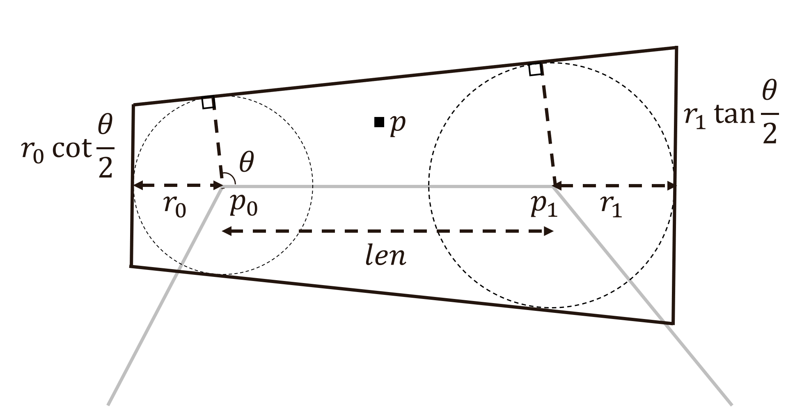

# Articulated Line Shaders Web Version

The web version of articulated line shaders. I inplement batch rendering and instanced rendering in this version to make it compatiable with web browser.

Check out for `js/main.js` for Threejs code. 

You will find the parameters in the shader code:

